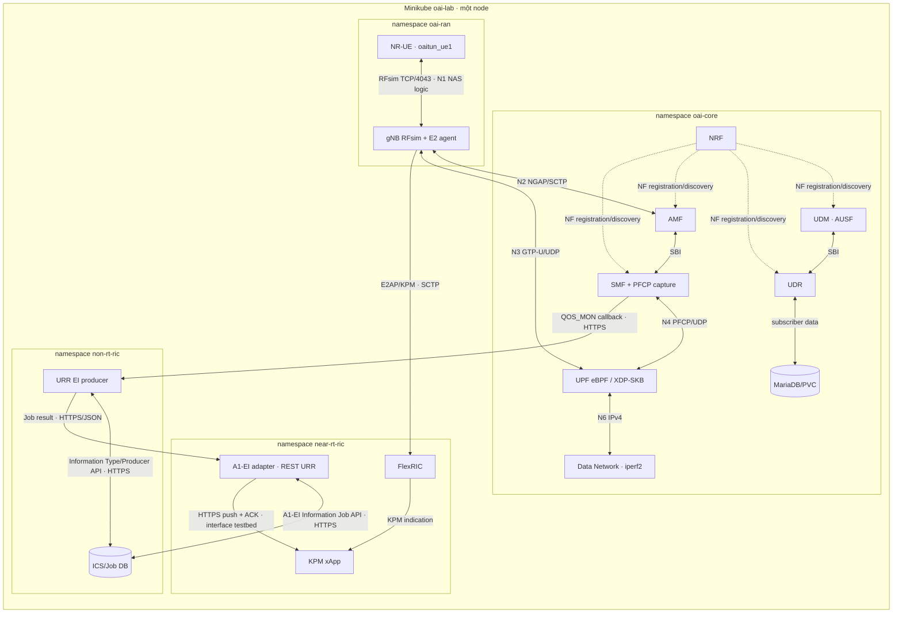
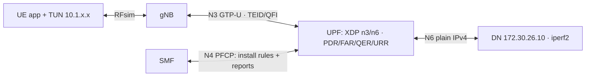

# Thiết kế testbed OAI 5G Core – eBPF UPF – O-RAN RIC trên minikube

**Bản mô tả:** 29/09/2026. **Phạm vi:** cấu hình và source trong workspace này, đối chiếu với run `20260929T095943Z-m35`. Đây là mô tả một testbed **single-node, single-UE, single-slice, single-UPF**, không phải kiến trúc sản phẩm HA. Các sơ đồ Mermaid có thể render trực tiếp trong GitHub/VS Code và xuất SVG cho đồ án hoặc paper.

## 1. Tóm tắt và trạng thái kiểm chứng

Testbed tích hợp 5G Core của OpenAirInterface (OAI), gNB/NR-UE chạy RF simulator, UPF eBPF/XDP, FlexRIC với KPM xApp, và một nhánh Non-RT RIC tối giản dùng O-RAN SC Information Coordination Service (ICS). Mục tiêu đo thực nghiệm là quan sát **cùng một phiên UE** ở ba mặt phẳng: traffic ứng dụng UL/DL, Usage Report trên PFCP N4, và KPM trên E2; sau đó đưa URR tới một endpoint Near-RT RIC qua vòng đời A1-EI Information Job.

Run sau khi restart UPF `20260929T095943Z-m35` có [acceptance.json](../artifacts/experiments/20260929T095943Z-m35/acceptance.json) `PASS`: receiver UL và DL mỗi chiều nhận `157290000` byte trong 120 giây, 0% loss theo iperf2; 26 PFCP Usage Report có response được chấp nhận; 310 mẫu KPM của node `gNB:3584`; XDP-SKB gắn N3/N6. [ei-correlation.json](../artifacts/experiments/20260929T095943Z-m35/ei-correlation.json) xác nhận cặp `(SEID=2, UR-SEQN=14)` có mặt tại PCAP PFCP, callback SMF, producer và A1-EI adapter; thời gian URR nằm trong cửa sổ KPM. Lượt này diễn ra sau một lần restart UPF có kiểm soát và tái tạo PDU session. **Mốc 4 vẫn PARTIAL:** chưa kiểm chứng chu kỳ down/up của cả bốn release và dữ liệu bền vững sau chu kỳ đó; xem [milestones.json](../artifacts/k8s/milestones.json).

Các số trên chứng minh một lượt hoạt động chức năng, **không** chứng minh hiệu năng tối đa, độ tin cậy thống kê, HA, multi-node, Internet breakout, hoặc điều khiển RAN khép kín. RFsim không dùng USRP hay kênh vô tuyến thật.

## 2. Ranh giới hệ thống và công nghệ

| Lớp | Thành phần cụ thể | Vai trò trong testbed |
|---|---|---|
| Host/cluster | Ubuntu 24.04; minikube profile/context `oai-lab`; Kubernetes `v1.33.13`; Docker driver; containerd trong node | Docker trên host chứa **node minikube** và phục vụ build/load image; workload chạy như pod trong Kubernetes/containerd. Dự trù 8 CPU, 16 GiB RAM. |
| Đóng gói/điều phối | Helm 3, bốn release; `scripts/k8s/lab.sh`, `staged.py` | Chart/values khai báo workload; CLI áp thứ tự khởi động, gate và thu artifact. Không gọi 5gdeploy/pipework trong backend mới. |
| Mạng | Pod network mặc định + Multus v4.2.2 + bridge CNI/static IPAM | `eth0` dành cho SBI, DB, DNS, HTTPS A1-EI/RFsim; `n2/n3/n4/n6/e2` là interface phụ, IP cố định trong node. [Multus upstream](https://github.com/k8snetworkplumbingwg/multus-cni). |
| 5G Core | NRF, UDR, UDM, AUSF, AMF phát hành OAI v2.2.0; SMF v2.2.0 có patch decoder; MariaDB 10.6 | Registration, authentication, subscriber/session management; SMF tạo PFCP rules/URR và phát callback. |
| User plane | OAI UPF eBPF/XDP từ source OAI có patch nghiên cứu | N3 GTP-U ↔ N6 IP, áp PDR/FAR/QER/URR và phát PFCP Usage Report. |
| RAN/UE | OAI gNB và NR-UE từ source; RFsim TCP | Tạo phiên 5G SA trên kênh mô phỏng; UE dùng TUN `oaitun_ue1`. |
| Near-RT RIC | FlexRIC + KPM xApp + Go `a1-ei-adapter` | FlexRIC nhận E2/KPM; adapter nhận URR qua A1-EI job và cung cấp REST feed. |
| Non-RT RIC tối giản | O-RAN SC ICS 1.6.1 pin digest + Go `urr-ei-producer` | Điều phối Information Type/Job; producer chuyển callback của OAI SMF thành dữ liệu job. Không có SMO/ONAP/Keycloak/Kafka. |
| Thí nghiệm | iperf2 UDP, tcpdump/tshark, CSV/JSON/PCAP, PVC | Đo traffic ở receiver và đối chiếu PFCP–SMF–A1-EI–KPM. |

Core chart dùng các NF chart OAI v2.2.0; RAN chart dùng gNB/NR-UE chart 2.4.0; FlexRIC chart 1.0.0. Chart gốc được pin ở commit `7925f939ea36a3c4c1df5525f3718ce8470f6b3f`; chart tích hợp nằm trong [`deploy/k8s/charts`](../deploy/k8s/charts) và topology chung trong [`minikube.yaml`](../deploy/k8s/values/minikube.yaml). Provenance image chạy thật nằm trong [metadata.json](../artifacts/experiments/20260929T095943Z-m35/metadata.json), không suy từ tag `unbuilt` trong values baseline.

| Source/release | Pin kiểm chứng trong workspace | Binary/image tại run ví dụ |
|---|---|---|
| OAI UPF source | Commit `00b7485329b2c07d6cf74bbfae53b7f7acf5de4e` và các patch URR/XDP/association/QFI kế tiếp | `oai-lab-upf:qfi-f6d0516adf20` |
| OAI SMF | Tag v2.2.0, source commit `d18906656ca85b823cc68877e3c545353150c018`, patch IE 43 | `oai-lab-smf:v2.2.0-ie43-771248b5` |
| OAI RAN/FlexRIC standalone | RAN `26efcc498931b8f6979c39f9f44400f3c965fdc4`; FlexRIC `ef6d722f22191eea74089966983da1f5ec1fedd4` | Radio `oai-lab-radio:30e854d39b1192d1`; FlexRIC image cùng khóa build trong lab |
| O-RAN SC ICS | Release 1.6.1, manifest digest `sha256:531eb929b9ee7b28fda5ffd17ed72f0c0d9c6466823c1223040fdae9c40795b6` | Image pin bằng digest trong chart Non-RT |
| Go producer/adapter | Source tại `src/urr-producer` và `src/a1-ei-adapter`; tag theo hash source | `oai-lab-urr-ei-producer:46e6e605470b7f9c`; `oai-lab-a1-ei-adapter:742c42929f1f81e9` |

Đối chiếu SHA và patch thực tế trong [`manifests`](../manifests) và [BUILD-FROM-SCRATCH.md](BUILD-FROM-SCRATCH.md); tag chỉ là tên image, còn ID `sha256` trong artifact là khóa binary của đúng run.

### 2.1. Sơ đồ thành phần



*Hình 1. Kiến trúc logic và ba luồng dữ liệu: user plane, E2/KPM và URR/A1-EI.*

Trong run `20260930T052819Z-m35`, chính binary C của xApp nhận URR qua HTTPS từ adapter, ACK sau khi SQLite commit, đồng thời tiếp tục ghi KPM từ E2. Đây là interface nội bộ testbed, không phải API A1-EI chuẩn hóa. Thành phần tiền xử lý dữ liệu dự kiến chưa được triển khai.

`scripts/k8s/lab.sh experiment` gọi `scripts/k8s/staged.py` và `scripts/k8s/analyze.py` trên **host** để tạo traffic, thu artifact và chấm gate sau phép đo. Bộ lệnh này đôi khi được gọi là *runner* hoặc *test harness*: nó không phải pod/NF/rApp/xApp, không nằm trên đường chuyển URR tới xApp và không thay thế thành phần tiền xử lý. File [`ei-correlation.json`](../artifacts/experiments/20260930T052819Z-m35/ei-correlation.json) xác nhận URR thật cùng `(SEID, UR-SEQN)` đã tới xApp và KPM có timestamp cùng khoảng thời gian.

## 3. Topology mạng, giao thức và endpoint

| Mạng/interface | Subnet và endpoint cố định | Payload/transport | Chức năng |
|---|---|---|---|
| N2 `n2` | `172.30.22.0/24`; AMF `.10`, gNB `.20` | NGAP trên SCTP/38412 | Điều khiển NG-RAN ↔ AMF; NG Setup, NAS relay. [ETSI TS 138 412](https://www.etsi.org/deliver/etsi_ts/138400_138499/138412/18.00.00_60/ts_138412v180000p.pdf). |
| N3 `n3` | `172.30.23.0/24`; UPF `.10`, gNB `.20` | GTP-U trên UDP/2152 | Tunnel user plane; UPF XDP-SKB gắn vào `n3`. |
| N4 `n4` | `172.30.24.0/24`; SMF `.10`, UPF `.20` | PFCP trên UDP/8805 | Association, heartbeat, Session Establishment/Modification, URR và Usage Report. [ETSI TS 129 244](https://www.etsi.org/deliver/etsi_ts/129200_129299/129244/17.10.00_60/ts_129244v171000p.pdf). |
| N6 `n6` | `172.30.26.0/24`; DN `.10`, UPF `.20` | IPv4/UDP iperf | Data network của lab; UPF XDP-SKB gắn vào `n6`; DN có route `10.1.0.0/16` qua UPF `.20`. |
| E2 `e2` | `172.30.27.0/24`; FlexRIC `.10`, gNB `.20`, xApp `.30` | E2AP/SCTP, FlexRIC service 36421/36422 | E2 Setup và KPM subscribe/indication. [ETSI TS 104 039](https://www.etsi.org/deliver/etsi_ts/104000_104099/104039/04.00.00_60/ts_104039v040000p.pdf). |
| Pod network `eth0` | IP pod động + Service DNS | HTTP/1 SBI cổng 80, MariaDB/3306, RFsim TCP/4043, A1-EI HTTPS | NRF/NF/DB, SMF→producer, ICS/adapter/producer và RFsim. |
| PDU UE | `10.1.0.0/16`; IP được cấp theo phiên, **không pin `.2`/`.4`** | IPv4 trong PDU session | `oaitun_ue1` của UE; DN trả gói về qua N6/UPF. |

Các NAD được tạo riêng theo namespace, cùng bridge vật lý nằm **bên trong node minikube**; IP secondary gắn bằng static IPAM và không thêm default route. Kubernetes Service/DNS dùng cho SBI/HTTPS/RFsim, còn N2/N3/N4/N6/E2 đi qua interface/IP telecom. Vì chạy single-node, bridge không chứng minh khả năng truyền giữa các node. Không có N9, Internet breakout hoặc hostNetwork cho NF. [Tài liệu Multus về NAD](https://github.com/k8snetworkplumbingwg/multus-cni/blob/master/docs/how-to-use.md).

Trong sơ đồ tham chiếu 5GS, **N1** là NAS UE↔AMF được gNB chuyển tiếp, **N11** là AMF↔SMF, **N12** là AMF↔AUSF, **N13** là AUSF↔UDM, và **N8/N10** liên quan dữ liệu UDM cho AMF/SMF. Ở testbed, các trao đổi control-plane NF↔NF tương ứng đi qua SBI/Service trên pod network; chúng **không** được gán một bridge Multus riêng tên `n11`, `n12` hay `n13`. UDR truy cập MariaDB để lưu subscriber; NRF phục vụ đăng ký/khám phá NF. Các tên reference point theo [ETSI TS 123 501](https://www.etsi.org/deliver/etsi_ts/123500_123599/123501/15.12.00_60/ts_123501v151200p.pdf); đây là ánh xạ kiến trúc, không phải khẳng định đã capture mọi HTTP operation của từng cặp NF trong cùng run.

### 3.1. Định danh mạng di động và radio

- PLMN `001-01`, TAC `7`, S-NSSAI SST `1`, SD cấu hình `FFFFFF`, DNN `nist-dnn`, PDU IPv4. Các NF biểu diễn SD “không chỉ định” theo cách riêng: template gNB bỏ trường SD khi bằng `FFFFFF`, trong khi UE config vẫn dùng `0xFFFFFF`; không nên viết rằng mọi bản tin trên dây luôn mang SD `FFFFFF`.
- RFsim gNB/UE: band 78, 106 PRB, numerology 1 (30 kHz subcarrier spacing), tần số UE CLI `3619200000` Hz. Đây là thông số mô phỏng, không có anten/USRP. UE resolve Service `oai-gnb-rfsim.oai-ran` trước khi chạy; gNB và UE nói chuyện bằng RFsim TCP qua pod network.
- E2 agent của gNB trỏ FlexRIC `172.30.27.10`. Build RAN/FlexRIC dùng E2AP v3 và E2SM-KPM v3.00; phải đồng phiên bản encoder/SM. [Tài liệu E2 của OAI](https://gitlab.eurecom.fr/oai/openairinterface5g/-/tree/2026.w09/openair2/E2AP?ref_type=tags) và [ETSI TS 104 040](https://www.etsi.org/deliver/etsi_ts/104000_104099/104040/04.00.00_60/ts_104040v040000p.pdf).

## 4. Thứ tự khởi tạo và thiết lập kết nối

Thứ tự được mã hóa trong [`staged.py`](../scripts/k8s/staged.py), không phải do Kubernetes tự bảo đảm giữa các Deployment. `resume` chỉ kiểm tra/khôi phục API minikube; `check` kiểm tra topology/image/render; `certs` tạo CA và Secret; `cutover` giữ release `oai-lab` cũ nhưng scale workload xuống 0 để không chiếm IP secondary.

1. **Hạ tầng:** node minikube, Multus, bốn namespace, NAD, Secret và PVC. Subscriber credential ở Secret; ConfigMap dùng placeholder và init container dựng config runtime, không đưa khóa SIM vào Helm values.
2. **Core:** MariaDB → Job upsert subscriber → NRF → UDR → UDM → AUSF → AMF → SMF → DN → UPF. Gate kiểm tra NF REGISTERED trong NRF, N4 association/heartbeat, route trả về N6 và XDP generic trên N3/N6. Readiness cho NF là socket; PFCP association là integration gate, không phải liveness probe tự restart khi peer chưa có.
3. **Non-RT RIC tối giản:** ICS HTTPS/PVC → producer. Producer đăng ký Information Type `oai-urr_1.0.0`, producer ID `oai-urr-producer` với ICS, rồi POST subscription `QOS_MON` vào SMF. Producer ghi SMF pod UID vào BoltDB để tránh subscribe lặp khi restart chính nó.
4. **Near-RT RIC:** FlexRIC → A1-EI adapter. Adapter `PUT /A1-EI/v1/eijobs/oai-urr-nearrt-ue1`, đọc `/status` định kỳ và chỉ Ready khi `eiJobStatus=ENABLED`.
5. **RAN:** xác nhận SMF–UPF PFCP còn sống trước UE → chạy fixture EI gate → khởi động xApp và gNB → xác nhận SCTP E2 established → mở capture N4 → chạy UE. UE đăng ký với AMF, được xác thực bằng dữ liệu subscriber, rồi gửi PDU Session Establishment. SMF chọn UPF, lập PDR/FAR/QER/URR qua PFCP; khi phiên thành công UE tạo `oaitun_ue1`. CLI kiểm thử trên host restart xApp sau khi UE có PDU IP để ghi cả mẫu theo UE, không chỉ theo cell.
6. **Thí nghiệm:** capture đã sẵn sàng trước UE; iperf2 UDP UL 120 giây rồi DL 120 giây; export PCAP/CSV/JSON, chạy gate offline và đối chiếu A1-EI real.

```mermaid
sequenceDiagram
  autonumber
  participant L as lab.sh / Helm
  participant C as Core: DB + NRF + SMF + UPF
  participant I as ICS
  participant P as URR producer
  participant R as FlexRIC + adapter
  participant G as gNB
  participant U as UE
  L->>C: DB seed, NF rollout, PFCP association
  C-->>L: NRF/PFCP/XDP gate PASS
  L->>I: Start ICS
  L->>P: Start producer
  P->>I: PUT Information Type + Producer
  P->>C: POST Nsmf Event Exposure QOS_MON subscription
  L->>R: Start FlexRIC + adapter
  R->>I: PUT EI Job; GET status
  I-->>R: ENABLED
  L->>G: Start gNB and KPM xApp
  G->>R: E2 Setup (SCTP)
  L->>C: Start N4 PCAP capture
  L->>U: Start NR-UE
  U->>G: RFsim/NAS registration + PDU request
  G->>C: NGAP/NAS toward AMF/SMF
  C->>C: PFCP Session Establishment / Create URR
  C-->>U: PDU session + UE IPv4/TUN
  G-->>R: E2 KPM Indications
```

*Hình 2. Thứ tự khởi tạo/thiết lập phiên; các NF core được gộp để sơ đồ dễ đọc.*

Sơ đồ sequence gộp các NF core vào một actor để dễ đọc. N1/NAS và N2/NGAP là các lớp khác nhau; RFsim chỉ thay đường radio/PHY giữa UE và gNB. Chưa có PCAP N1/N2 của **cùng run** để liệt kê và chứng minh từng NAS/NGAP message; chuỗi đăng ký ở đây là kiến trúc và được gate xác nhận ở mức kết quả UE/PDU.

### 4.1. Khởi động lại UPF có IP N4 tĩnh

Kubernetes có thể cấp **MAC mới** cho pod UPF thay thế trong khi IP N4 vẫn là `172.30.24.20`. Đã quan sát SMF gửi PFCP Association Request tới MAC cũ, mất heartbeat, làm UPF graph rỗng và UE nhận PDU reject; [biên bản root cause](../artifacts/k8s/diagnostics/m4-upf-restart-recovery.md). Lệnh `lab.sh restart-upf`/`rollout upf` yêu cầu dừng UE, chờ UPF cũ biến mất, xóa N4 neighbor trong SMF, bật UPF, rồi chờ graph/heartbeat trước khi bật UE. Đây là xử lý vận hành dành cho Multus static IP trên một node, không phải một bước 3GPP.

## 5. Đường user plane và QFI

**UL:** ứng dụng trên UE gửi UDP iperf qua `oaitun_ue1` → stack NR-UE/RFsim → gNB → gNB đóng GTP-U trên N3 tới UPF → eBPF/XDP khớp PDR, áp FAR/QER/URR → UPF chuyển inner IPv4 ra N6 → iperf receiver ở DN. **DL:** DN gửi tới PDU IPv4 của UE → route `10.1.0.0/16 via 172.30.26.20 dev n6` → UPF XDP-SKB trên N6 khớp CORE PDR và đóng GTP-U tới gNB N3 → gNB gửi qua RFsim → `oaitun_ue1` → iperf receiver ở UE.



*Hình 3. Đường UL/DL hai chiều qua RFsim, N3, eBPF UPF và N6.*

PDR xác định gói/phiên, FAR chỉ thị forward/encapsulate, QER áp QoS, URR đo và trigger báo cáo. QFI là định danh **QoS Flow** trên GTP-U/SDAP, không phải IP hay TEID. Với phiên một QoS flow của lab, patch [`dl-qfi-from-access-pdr`](../patches/oai-upf-00b7485-dl-qfi-from-access-pdr.patch) chỉ suy ra QFI cho DL CORE PDR khi SMF không đưa QFI vào CORE PDR/QER và ACCESS PDR của **cùng session** có một QFI duy nhất; nếu nhiều QFI khác nhau thì không đoán. Không cần gửi UL iperf trước để “học QFI”: thông tin đến từ PFCP PDR được cài khi lập session. DN tắt TX checksum offload trên `n6` để inner UDP checksum hoàn tất trước khi XDP-SKB xử lý; chi tiết ở [`dn.yaml`](../deploy/k8s/charts/core/templates/dn.yaml). Datapath XDP generic/SKB đã kiểm tra bằng program ID trên cả hai interface; hiện không đo hiệu năng native XDP.

## 6. Đường URR, QOS_MON, A1-EI và KPM

### 6.1. Đường đo lưu lượng core

SMF đặt Create URR trong PFCP Session Establishment; UPF lưu rule/map eBPF cho SEID/URR, đếm byte/gói và xét trigger. Khi đủ điều kiện, event đi qua ring buffer tới `UrrReportConsumer` ở userspace, rồi thành PFCP Session Report Request (Usage Report) gửi SMF; SMF trả Session Report Response/Cause accepted. UPF upstream đã có eBPF/XDP; phần nối **URR event → PFCP report** và sửa map/trigger là [patch nghiên cứu riêng](../patches/oai-upf-00b7485-pfcp-urr-reporting.patch). UPF hiện chỉ hỗ trợ một URR/session theo giới hạn implementation. Patch [XDP mode](../patches/oai-upf-xdp-mode.patch) ép `skb` khi chạy Kubernetes; patch [CP-initiated PFCP association](../patches/oai-upf-cp-initiated-association.patch) sửa đường association; [SMF IE 43 decoder](../patches/oai-smf-v2.2.0-pfcp-up-features-extension.patch) cho phép SMF v2.2.0 đọc sáu octet feature đã biết và bỏ qua extension không hiểu trong IE dài 8 byte mà vẫn giữ FTUP. [Phân tích tương thích](SMF-PFCP-COMPATIBILITY.md).

Trong PCAP của run được trích ở đây, Create URR có `DLVOL=1000` byte; đó là **giá trị thực đọc từ PFCP**, không phải một trường threshold mới đã được implement trong OAI SMF. File `pfcp_urr_config.csv` còn cho biết trigger/measurement method. Một report chỉ chứng minh được UPF phát nó; cần response Cause accepted mới chứng minh SMF nhận/chấp nhận.

### 6.2. Chuyển sang A1-EI

SMF dùng Nsmf Event Exposure `QOS_MON` để callback tới producer qua HTTPS. `QOS_MON` thuộc dịch vụ chuẩn hóa trong [ETSI TS 129 508](https://www.etsi.org/deliver/etsi_ts/129500_129599/129508/18.08.00_60/ts_129508v180800p.pdf), nhưng trường `customized_data["Usage Report"]` chứa SEID/UR-SEQN/byte ở đây là **hành vi OAI**, không phải schema URR tiêu chuẩn của O-RAN. Producer Go chuẩn hóa và gắn Information Type riêng `oai-urr_1.0.0`; ICS quản lý type/producer/job, không phải data broker. Adapter tạo job và đợi `ENABLED`; producer gửi JSON **trực tiếp** tới `jobResultUri` của adapter bằng HTTPS. Vòng đời Information Type/Job và API A1-EI tham chiếu [ETSI TS 103 987](https://www.etsi.org/deliver/etsi_ts/103900_103999/103987/04.03.00_60/ts_103987v040300p.pdf), [kiến trúc A1 ETSI TS 103 982](https://www.etsi.org/deliver/etsi_ts/103900_103999/103982/08.00.00_60/ts_103982v080000p.pdf) và [O-RAN SC ICS API](https://docs.o-ran-sc.org/projects/o-ran-sc-nonrtric-plt-informationcoordinatorservice/en/latest/ics-api.html). **Mapping từ OAI callback sang type này là phần tích hợp riêng của testbed**, cần ghi đúng như vậy trong paper.

```mermaid
sequenceDiagram
  autonumber
  participant X as UPF XDP/eBPF
  participant U as UPF userspace
  participant S as OAI SMF
  participant P as URR EI producer
  participant I as ICS
  participant A as A1-EI adapter
  participant G as gNB
  participant R as FlexRIC
  participant K as KPM xApp C
  S->>U: PFCP Create URR (N4)
  U->>X: Cài URR map / trigger
  X-->>U: Ring-buffer report event
  U->>S: PFCP Session Report Request + Usage Report
  S-->>U: PFCP Session Report Response · Cause accepted
  S->>P: Nsmf Event Exposure QOS_MON · customized_data
  P->>P: Normalize + dedup (SEID, UR-SEQN)
  P->>I: Reconcile Information Type / Producer
  A->>I: PUT Information Job; GET status
  I-->>A: ENABLED
  I->>P: Job callback / filter
  P->>A: HTTPS POST job result JSON (trực tiếp)
  A->>K: HTTPS POST /v1/urr/events + ACK (testbed nội bộ)
  K->>K: Validate, dedup, SQLite commit trước ACK
  G->>R: E2 KPM indications
  R->>K: KPM subscription/indications
```

*Hình 4. Đường URR từ eBPF/PFCP qua OAI SMF và Information Job; KPM là luồng độc lập.*

Schema normalized gồm `schema_version`, `run_id`, `observed_at`, `smf_timestamp`, `supi`, `seid`, `urr_id` nullable, `ur_seqn`, `triggers[]`, byte/gói UL/DL/total, `duration_seconds`, `dnn`, `snssai`, `enrichment_source`. `DNN` và `S-NSSAI` có thể lấy từ cấu hình một UE; `enrichment_source=lab-config` chỉ rõ provenance. Producer ghi raw callback, normalized JSONL/CSV, queue trạng thái và dead-letter trên PVC; BoltDB chống trùng bằng `(SEID, UR-SEQN)`, hàng đợi giới hạn 1000 bản ghi, retry tối đa sáu lần với backoff. Adapter cũng dedup theo cặp đó, lưu BoltDB/JSONL và cung cấp `GET /v1/urr` cùng `/latest`. Chi tiết nằm trong [`producer/types.go`](../src/urr-producer/internal/producer/types.go), [`producer/server.go`](../src/urr-producer/internal/producer/server.go) và [`adapter/server.go`](../src/a1-ei-adapter/internal/adapter/server.go).

**Giới hạn quan trọng cho nghiên cứu:** producer hiện không được chart truyền `RUN_ID`, nên `run_id` trong JSONL thực tế là `bootstrap`. Harness xác định lượt đo bằng PCAP/phases/time window và `(SEID, UR-SEQN)`, không dùng trường đó làm khóa toàn cục. Va chạm dedup đã được quan sát ở run `20260930T053547Z-m35`: session mới dùng lại SEID 2 / UR-SEQN 1–26, SMF gửi raw callback nhưng producer bỏ qua vì các khóa đã tồn tại trong BoltDB. **Đã xử lý 01/10/2026 (A.4):** producer gán `session_epoch` = thời điểm bắt đầu session (`smf_timestamp − Duration`, sai số ±1 s, ngưỡng tách 3 s; trùng khóa khác nội dung cũng mở epoch mới), schema 1.1.0; khóa chống trùng ở producer, adapter và xApp là `(SEID, epoch, UR-SEQN)`. Kiểm chứng: SEID 1 tái sử dụng sau restart SMF, 26/26 report tới xApp ([`epoch-a4-20261001`](../artifacts/k8s/diagnostics/epoch-a4-20261001/summary.txt)). Không xóa PVC để che va chạm. ICS 1.6.1 trong lab trả 400 với `statusNotificationUri`, nên adapter dùng GET status định kỳ thay vì callback status. xApp đã nhận URR thật và KPM; chưa có logic ghép feature KPM–URR hoặc điều khiển closed loop.

### 6.3. KPM từ RAN

E2 agent của gNB thiết lập SCTP E2 với FlexRIC; xApp đăng ký E2SM-KPM chu kỳ cấu hình 1000 ms và ghi `KPI_Metrics.csv`/`KPI_Metrics_Cells.csv`. Mẫu gồm E2 node ID, UE ID và các measurement như PDCP SDU volume, RLC delay, UE throughput, PRB utilization; đây là **chỉ số từ RAN**, không phải PFCP URR từ UPF. OAI liệt kê các measurement E2SM-KPM hỗ trợ trong [tài liệu E2](https://gitlab.eurecom.fr/oai/openairinterface5g/-/tree/2026.w09/openair2/E2AP?ref_type=tags). Correlator hiện yêu cầu có KPM sample trong cùng khoảng thời gian URR; với **một UE** có thể phân tích song song, nhưng chưa chứng minh ánh xạ UE ID KPM ↔ SUPI trên nhiều UE. Không nên trình bày là đã join từng mẫu KPM với từng PFCP report theo khóa UE chuẩn hóa.

## 7. Bảo mật, trạng thái và khả năng tái lập

- Chỉ UPF workload trong `oai-core` chạy privileged để load/attach eBPF; UE dùng `/dev/net/tun` và `NET_ADMIN`; producer/adapter dùng user không phải root. Các NF còn lại không được bật privileged mặc định. `oai-core` namespace cho phép mức Pod Security cần cho lab, không phải chính sách production.
- Lab CA và cert SAN cho ICS, producer, adapter nằm trong Kubernetes Secret; producer/adapter verify server cert, SMF được mount CA để callback HTTPS. Producer gọi SBI của SMF bằng **HTTP** trên pod network. Không có mTLS/OAuth2, service mesh hay IPsec E2/N2/N4; không tuyên bố bảo vệ end-to-end. Minikube bridge CNI không được coi là thực thi NetworkPolicy.
- MariaDB PVC 2 GiB, artifact PVC core 2 GiB, ICS PVC 2 GiB, producer/adapter PVC riêng 1 GiB; không mount chung PVC xuyên namespace. Subscriber Job upsert để seed lại không DROP database. ICS lưu job/type/producer trên filesystem PVC; producer/adapter lưu BoltDB và artifact.
- Image research được build từ source workspace, load vào minikube và khóa ID trong artifact; SMF patch v2.2.0, UPF source/patch riêng, RAN/FlexRIC build tương thích E2. [Source/provenance](BUILD-FROM-SCRATCH.md), [patch details](PATCH-DETAILS.md), [image metadata](../artifacts/experiments/20260929T095943Z-m35/metadata.json). Root `Codebase` là snapshot gom source, **không** phải một Git monorepo có lịch sử merge đầy đủ.

## 8. Phương pháp đo, artifact và cách đọc kết quả

Harness kiểm thử chạy trên host yêu cầu PCAP N4 mở trước khi UE lập PDU session, sau đó chạy iperf2 UDP `-b 10M -l 1200 -t 120` cho từng chiều; receiver phải có byte dương. `-l 1200` giữ inner UDP + N3 encapsulation dưới MTU lab. `tshark` trích Create URR, Session Report/Response, SEID/UR-SEQN/trigger/counter; `bpftool` chụp XDP; xApp ghi KPM CSV. Các artifact được xuất vào [`artifacts/experiments/20260929T095943Z-m35`](../artifacts/experiments/20260929T095943Z-m35/), gồm `phases.csv`, sender/receiver CSV, `pfcp.pcap`, `pfcp_urr*.csv`, `KPI_Metrics*.csv`, `producer/`, `adapter/`, `xdp.json`, `metadata.json`, `acceptance.json` và `ei-correlation.json`.

| Câu hỏi nghiên cứu | Bằng chứng phù hợp | Không được suy ra |
|---|---|---|
| Gói UL/DL đến ứng dụng đích chưa? | **Receiver** iperf CSV và loss từng chiều; counter TUN/N3 trước/sau | Chỉ sender CSV hoặc UPF counter không chứng minh UE/DN nhận. |
| URR được cấu hình ra sao? | Create URR trong PCAP và `pfcp_urr_config.csv` | Không lấy ngưỡng từ metadata/values thay bản tin SMF thực. |
| SMF chấp nhận Usage Report chưa? | PFCP Session Report Request **và** Response Cause accepted khớp transaction | Chỉ UPF log “sent report” chưa đủ. |
| Dữ liệu tới A1-EI chưa? | Cặp `(SEID, UR-SEQN)` ở PFCP, SMF raw callback, producer normalized, adapter JSONL; job `ENABLED` | Fixture gate riêng không thay URR thật. |
| Có KPM cùng lượt? | `KPI_Metrics.csv` có node/UE và timestamp chồng URR | Time overlap chưa phải quan hệ nhân quả hoặc mapping UE chuẩn hóa. |
| XDP chạy mode yêu cầu chưa? | `xdp.json`/`bpftool net` có program N3/N6 mode `generic` | Pod `Ready` hoặc `enable_bpf_datapath=true` không chứng minh attach. |

Trong [acceptance.json](../artifacts/experiments/20260929T095943Z-m35/acceptance.json), `pfcp.ulBytes`/`dlBytes` là **tổng các trường volume trong nhiều report** theo logic analyzer hiện tại. Một số URR report có thể chứa counter tích lũy hoặc nhiều trigger cho cùng cửa sổ; do đó không được gọi các tổng này là số byte duy nhất đã truyền hay so bằng tuyệt đối với `157290000` byte iperf. Muốn phân tích sai số giữa lớp ứng dụng và UPF cần xác định semantics từng URR/trigger, loại trùng, hiệu chỉnh header và dùng counter delta có cùng khoảng thời gian. Chưa có lặp nhiều run/CI để báo interval thống kê.

## 9. Ranh giới đóng góp và phần còn thiếu

**Có thể mô tả là đã làm:** tích hợp eBPF UPF có PFCP URR thật với SMF v2.2.0; đưa report qua Event Exposure tùy biến tới A1-EI Information Job, adapter và chính binary KPM xApp; ghép bằng chứng với KPM/traffic trong testbed K8s bốn namespace. Run [`20260930T052819Z-m35`](../artifacts/experiments/20260930T052819Z-m35/ei-correlation.json) xác nhận PFCP → SMF → producer → adapter → xApp với counter khớp, UL/DL 10 Mbit/s × 120 giây và KPM cùng khoảng thời gian. Restart xApp/adapter giữ state, retry queue khi xApp tắt không làm nhân đôi report. UPF eBPF/XDP nền, nhiều NF OAI, FlexRIC và ICS là phần có nguồn gốc upstream; phải tách chúng khỏi patch/adapter/orchestrator của testbed khi viết đóng góp.

**Chưa chứng minh/triển khai:** full down/up lifecycle và session epoch khi SEID được tái sử dụng; preprocessing và policy/control closed-loop; A1 Mediator tích hợp vào FlexRIC; rApp đóng gói theo framework SMO đầy đủ; ánh xạ KPM UE ID↔SUPI nhiều UE; nhiều slice/UPF, HA/multi-node, USRP, native XDP, Internet breakout, bảo mật telco production, custom SMF threshold, đo hiệu năng/độ trễ A1-EI với nhiều lần lặp. Non-RT RIC hiện là **ICS + producer tối giản**, không phải toàn bộ nền tảng SMO/Non-RT RIC.

**Hướng closed loop đã thiết kế (chưa triển khai):** phòng thủ hai lớp theo [TWO-LAYER-DEFENSE-PLAN.md](TWO-LAYER-DEFENSE-PLAN.md). xApp là nơi duy nhất ra quyết định (detector KPM, kiểm tra nhất quán KPM↔URR để phát hiện KPM bị sửa trên E2, danh tiếng UE theo SUPI, escalation). Lớp RAN thực thi qua E2SM-RC (giới hạn PRB, RRC Release) — cần patch gNB vì control handler hiện là stub. Lớp core là eBPF UPF: guard quota theo cửa sổ trong XDP (phản xạ không cần xApp), map `sec_policy_by_supi` (pinned) dẫn xuất sang policy theo SEID qua PFCP User ID IE, stage XDP `PROG_SEC_POLICY` trước PDR match, và Security API có giới hạn tự áp cho xApp. SMF chỉ thay đổi chuẩn (User ID IE, cấu hình URR). Phase 0 đã chứng minh chuỗi PFCP Update FAR → `rules_match_pdr` → XDP drop ([run](../artifacts/experiments/20260930T073310Z-phase0-far/summary.json)).

Để viết paper, nên đặt giả thuyết định lượng riêng (ví dụ độ trễ từ PFCP report đến adapter, độ lệch volume theo chiều/trigger, ảnh hưởng XDP-SKB lên CPU/throughput), định nghĩa timestamp ở từng điểm, chạy nhiều lượt độc lập, báo median/percentile và interval, rồi phân biệt kết quả quan sát với phần mô phỏng. Run hiện tại là **bằng chứng feasibility/functionality**, chưa phải bộ số liệu hiệu năng hoặc causal evaluation.

## 10. Nguồn chuẩn và điểm vào code

| Chủ đề | Nguồn chính |
|---|---|
| Kiến trúc O-RAN/A1-EI | [ETSI TS 103 982](https://www.etsi.org/deliver/etsi_ts/103900_103999/103982/08.00.00_60/ts_103982v080000p.pdf), [ETSI TS 103 983](https://www.etsi.org/deliver/etsi_ts/103900_103999/103983/04.00.00_60/ts_103983v040000p.pdf), [ETSI TS 103 987](https://www.etsi.org/deliver/etsi_ts/103900_103999/103987/04.03.00_60/ts_103987v040300p.pdf), [ICS overview](https://docs.o-ran-sc.org/projects/o-ran-sc-nonrtric-plt-informationcoordinatorservice/en/latest/overview.html), [ICS API](https://docs.o-ran-sc.org/projects/o-ran-sc-nonrtric-plt-informationcoordinatorservice/en/latest/ics-api.html). |
| Kiến trúc 5GS/SBI/reference point | [ETSI TS 123 501](https://www.etsi.org/deliver/etsi_ts/123500_123599/123501/15.12.00_60/ts_123501v151200p.pdf). |
| PFCP/URR và SMF Event Exposure | [ETSI TS 129 244](https://www.etsi.org/deliver/etsi_ts/129200_129299/129244/17.10.00_60/ts_129244v171000p.pdf), [ETSI TS 129 508](https://www.etsi.org/deliver/etsi_ts/129500_129599/129508/18.08.00_60/ts_129508v180800p.pdf). |
| NG/E2/KPM/RFsim | [ETSI TS 138 412](https://www.etsi.org/deliver/etsi_ts/138400_138499/138412/18.00.00_60/ts_138412v180000p.pdf), [ETSI TS 104 038](https://www.etsi.org/deliver/etsi_ts/104000_104099/104038/04.01.00_60/ts_104038v040100p.pdf), [ETSI TS 104 039](https://www.etsi.org/deliver/etsi_ts/104000_104099/104039/04.00.00_60/ts_104039v040000p.pdf), [ETSI TS 104 040](https://www.etsi.org/deliver/etsi_ts/104000_104099/104040/04.00.00_60/ts_104040v040000p.pdf), [OAI E2 agent guide](https://gitlab.eurecom.fr/oai/openairinterface5g/-/tree/2026.w09/openair2/E2AP?ref_type=tags). |
| Triển khai thực tế | [`deploy/k8s/values/minikube.yaml`](../deploy/k8s/values/minikube.yaml), [`deploy/k8s/charts`](../deploy/k8s/charts), [`scripts/k8s/staged.py`](../scripts/k8s/staged.py), [`scripts/k8s/analyze.py`](../scripts/k8s/analyze.py), [`docs/K8S-A1-EI.md`](K8S-A1-EI.md), [`docs/SMF-PFCP-COMPATIBILITY.md`](SMF-PFCP-COMPATIBILITY.md). |

Các liên kết ETSI/OAI/O-RAN SC là **nguồn tiêu chuẩn hoặc upstream**; những con số IP, image, thứ tự rollout, schema `oai-urr_1.0.0` và kết quả PASS là **quan sát/cấu hình của workspace này**. Không dùng tài liệu này như bằng chứng rằng upstream OAI đã phát hành patch URR hoặc O-RAN đã chuẩn hóa payload OAI `customized_data`.
